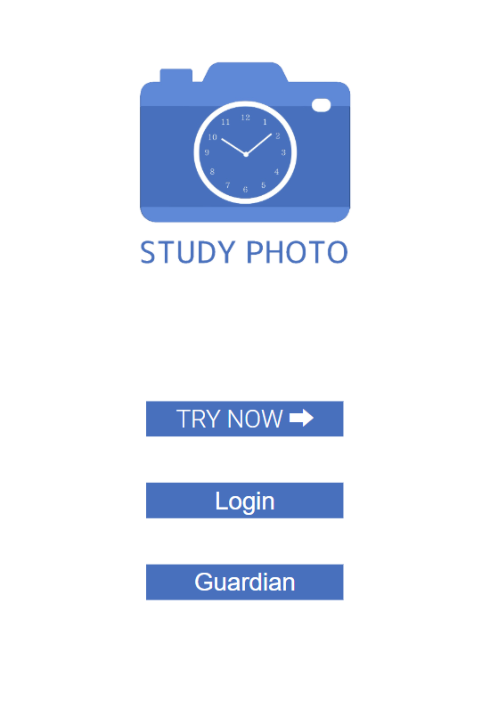

# ChildApp

中高生の勉強習慣がついていない人を対象とした学習管理アプリ。  
学習の時間・内容を管理共有し、学習のモチベーション・効率・管理状況の向上を図る学習管理アプリ。  

# 機能面
  
使用者用サインイン,使用者用ログイン,保護者用サインインがある。 

## 使用者ホーム画面
  
ホーム画面には「勉強する」と「記録を見る」がある。そのほかに設定と問い合わせの機能が備わっている。  

## 勉強する　
「勉強する」にはタイマー機能と勉強の写真や教科を記録する直後記録機能が備わっている。  

タイマー機能は勉強時間を計ることができる。  
  
直後記録機能→勉強時間，勉強内容等を教科別に保存できる  

1. 勉強時間を表示 
2. 教科を選択(国語，数学，英語)  
3. 教科を編集→②に無い教科を追加，編集，削除ができる。 
4. 画像を追加→勉強内容の写真を保存
5. 画像を削除→誤って追加してしまった画像の削除
6. コメント記入→勉強内容などのメモ等が可能
7. 登録→登録することで指定した教科のところに勉強内容が記録できる。なお、記録は「記録を見る」から閲覧することができる。

## 記録を見る
「記録を見る」には「勉強する」で記録したものを閲覧することができる。    
  
1. 勉強内容の閲覧  
2. 勉強画像の閲覧  
3. 保護者からのコメント  
4. 1日の中での勉強時間帯を閲覧できる  
5. 1週間の中での勉強時間を閲覧できる  
6. 1ヶ月の中での勉強時間を閲覧できる  
7. 1年の中での勉強時間を閲覧できる  

https://studyphoto.net/
